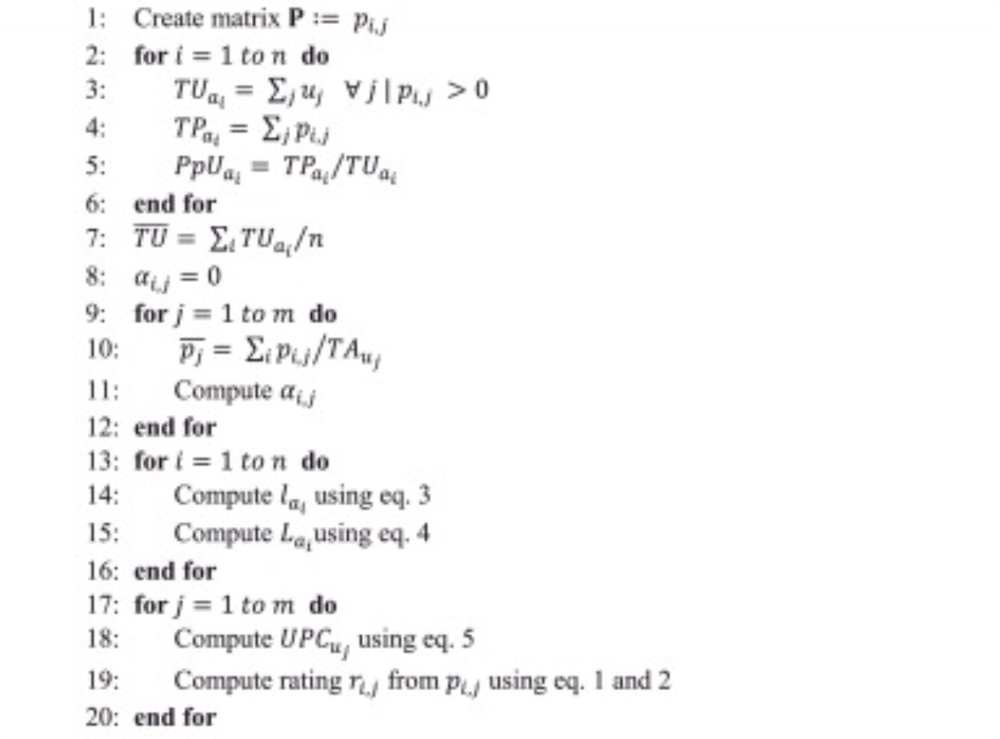
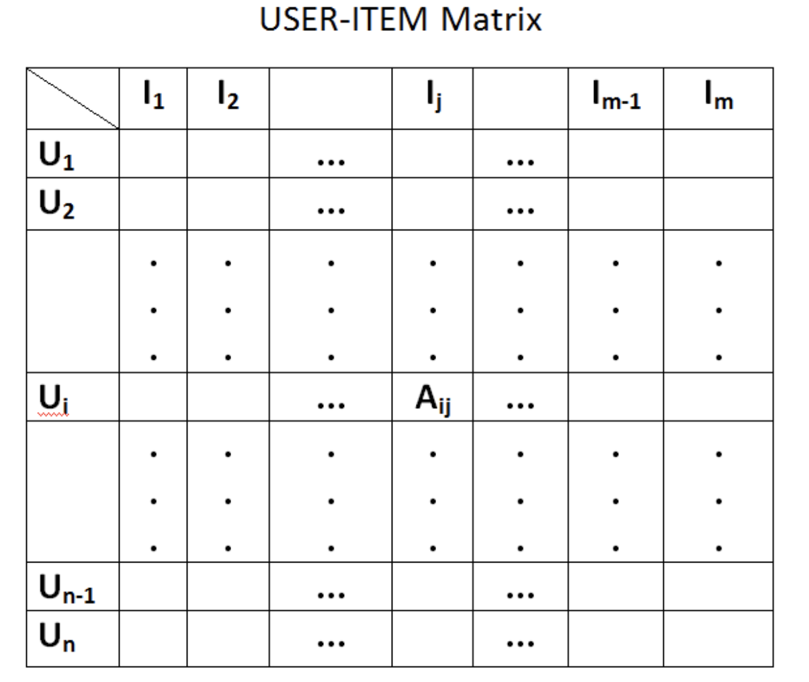

# Music Recommender System 
## Goal 
Provide personalized music recommendations to users, which help them to find music they liked before easily and discover music they might otherwise not have found. Being able to accurately predict the users’ interests and recommend music items that they would be interested could improve the users’ experience and engagement, thus increase sales, subscription and company’s revenue. 

## Possible Problems 
### Early Rater 
When new products are introduced in the system, these items have never been rated, therefore they cannot be recommended. 
- Temporary Solution: Use median/ x-th percentile of the rating of all items as the rating of new item.
- Optimal Solution: Create item profiles, such as the item is related to which artists, music genre, sentiment and such. Recommend these items to users who are interested in item with similar profile.

### Cold Start 
When new users just joined the platform, they have never listened to any music yet so the system does not know their preference at all. 
- Temporary Solution: Provide a list of artists and bands and ask them which ones they might be interested. 
- Optimal Solution: Create user background profiles, such as age, gender and where they are from. Recommend items to new users based on users who have similar backgrounds. 

### Gray Sheep
Users who have unusual preferences and they do not have enough neighbors for computing reliable recommendations. 
- Optimal Solution: Create a user playing coefficient (Sanchez-Moreno et al, 2016) to determine their degree of uncommonness of their preferences. Users with high value indicates they like popular artists while users with low value indicates they correspond to gray sheep users.

## Available Information (Data) 
### [Last.fm database](http://ocelma.net/MusicRecommendationDataset/lastfm-360K.html)
1. Usersha1-artmbid-artname-plays.tsv 
Contains identifiers of users and artists and the number of plays representing how many times each user has listen to each artist 
2. Usersha1-profile.tsv
Contains user profile information such as gender, age and country

### Related database 
1. [MusicBrainz](https://musicbrainz.org/doc/MusicBrainz_Database)  
MusicBrainz Identifier is included in the Usersha1-artmbid-artname-plays.tsv. MusicBrainz created profiles for artists and contains information such as genres, rating and tags. 

## System Design - Hybrid Recommender System
The recommender systems uses a hybrid approach by combining collaborative filtering and content-based filtering.

### Stages:
### 1. Matrix and Profiles Creation 
The goal of this stage is to data for the recommender system to use. In this stage, we will create the following matrix and profiles.
1. Item-User Rating Matrix   
Create a item-user matrix based on the counts of plays. Then the rating of the item is created using the counts of plays the user j plays an artist i divided by the total number of plays of user j.

2. Artist/ Band Profile  
Contains artists/ bands’ information such as average user rating, music genre, and sentiment. It will also contain the artist popularity coefficient proposed in Sanchez-Moreno et al, 2016. 

3. User Background Profile  
Contains users’ background information such as age, gender and origin. 

4. User Preference Profile  
It will also contain information about users’ preference on music genres, artists/ bands as well as the user playing coefficient proposed in Sanchez-Moreno et al, 2016. 

### 2. Users’ Unlistened Item Rating Prediction 
The goal of this stage is to predict the ratings for unlistened items. The unlistened items stand for those artists that have never been listened by the active user. The system will find top K most similar users and make item rating prediction based on their rating. This is mainly used to address the cold star and gray sheep problem.   
   
Unlistened Item Rating = User Background Profile Similarity (UBPS) * UBPS Modifier +  User Preferences Profile Similarity (UPPS) * UPPS Modifier 
  			   

### 3. Create Item Recommendation Score 
The hybrid item recommendation score systems will use weighting to combining the score of the above recommendation components numerically. Including the Artist/ Band Profile Similarity because it could solve the cold start problem.  
  
Item Recommendation Score  = Item-User rating Similarity (IUS) * IUS Modifier + Artist/ Band Profile Similarity (ABPS) * ABPS Modifier + Unlistened Item Rating (UIR) * UIR Modifier 
  
This architecture allows us to address different possible use cases:
- New Users: For users who just joined the platform and exploring the music on it randomly, we can increase the weight of the IUS modifier and help them discover music they would like based on the people who shared similar background.  
- Push new artist/ band: If we want to push more new artist/ band to the users, we can increase the weight of the BPS modifier

### 4. Generate Recommend Item List
The goal of this stage is to create a ranking list for all items. And the top N items with the highest item recommendation score will be recommended to the active user. 

## Current Approach - [Music Recommender System Prototype](https://github.com/Sally-Ng/hk01_offsite_test/blob/master/question_3b/music_recommender_system_prototype.ipynb)  
`Rome Wasn’t Built in a Day, But They Were Laying Bricks Every Hour`   
  
So we are going to start small. We will create the item rating matrix and part of the Artist/ Band Profile, the artist popularity coefficient. Then the recommendation system will generate recommendations based on the item similarity. In the future, we will continue to evaluate, tune and add new components to the system.   
This system starts with the item-based collaborative filtering instead of user-based collaborative filtering because there tends to be more users than items, so computing similarities between all pairs of items will be less expensive. Moreover, user profiles changed quickly but items’ average rating is rather stable, so the entire system model will not need to be recomputed as often.

### Steps:
1. Create the artist popularity coefficient   
</img>   
Create the user playing coefficient to capture the popularity of the item (artist) following the pseudocode proposed in Sanchez-Moreno et al, 2016. And in this stage, instead of addressing the gray sheep problem, the artist popularity coefficient is simply used as an item attribute to improve the accuracy of the recommender system.

2. Create the item-user rating matrix   
</img>   
First, create a user-item matrix based on the counts of plays. Then the rating of the item is created using the counts of plays the user j plays an artist i divided by the total number of plays of user j.   
This method is relatively naive, a more optimal approach would be to use the method Su et al., 2017 used to transform the play counts into ratings. For each user, the play counts are divided into two ranges by a threshold using mean, standard deviation and a weight. Play counts lower than the threshold are regarded as negative preference and will be divided into two equivalent sub-ranges {1, 2}. Play counts higher than the threshold are regarded as positive preference and will be divided into three equivalent sub-ranges {3, 4, 5}. This method should be more accurately predict users’ rating as it cut the users’ positive preference in smaller space.   
Secondly, transpose the matrix so it will become an item-user rating matrix.  

3. Merge the artist popularity coefficient with the item-user rating matrix  

4. K-nearest neighbor (K-NN) to find similar items and generate a item recommendation table  
K-NN builds a neighboard of K items similar to the item the user is listening to. It will select the top N most similar items and recommend them to the user.

5. Make prediction  
When a user is listening to artist x, we can query item recommendation table and make recommendations to him/her. 

## System Evaluation/ Metrics to track 
1. Precision  
The fraction of recommended items that is actually relevant to the user.
2. Normalized Discounted Cumulative Gain (NDGG) 
Evaluate the ranking quality as highly relevant items are more useful if appearing earlier in recommendation list.
3. Root Mean Square Error (RMSE)  
Evaluate the item rating prediction error, the difference between the predicted rating and the ground truth. 
4. User’s Recommendation Click Rate - Real World Performance Evaluation  
How likely the user is going to click on the recommended items.
5. Users’ Recommendation Click Position - Real World Performance Evaluation  
The position of the recommended item the user clicked from the item recommendation list. 

## Possible concerns
### Scalability and performance (run time) of the recommendation   
The current approach uses Item-User Rating Matrix, the matrix would get extremely large with the increase of users and items and it may affect the run time of reacting to online requirements and make recommendations for all users. However, because we are using the item recommendation table to make prediction and since items' rating is rather stable, we can create an ETL job to generate the table and update the table in our database once every hours. 
